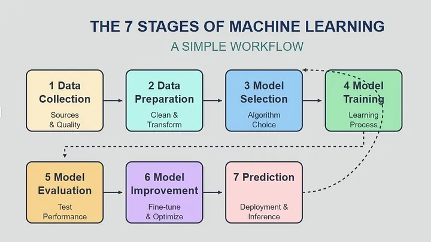

# Machine learning
Machine learning (ML) is a fild of artificial intelligence that enables computers to learn patterns from data widouth being explicitly programmed. It uses algorithm to make predictions based on past examples. The model consisct of neural network that applies  multiple simple linear algebra funtions (and their derivatives) on the input data in order to extract information from it. Data passes thrue model multiple times and on every ocasion the model ajusts it-self.

## Types of machine learning
ML is devided into thre classes

### Supervised learning
Most commonly used type of machine learning. Machine is given data point and label for that data point. ML model tries to recognize dependencies and relationships between data points and labels. It is used for regression and clasification.

### Unsupervised learning
Is used in cases where data is not labeled. Model tries to identifie patterns without external help. It is used in cluster analisys and anomaly detection.

### Reinforcement learning
Used in cases where the model is train on develloped virtual enviroment and is "revarded" based on it's decisions. 

## Lifecycle of machine learning project

### Data collection
Data is colected form various saurces. Collected data needs to realisticly represent the situation the model is going to be used for. Data can be generated. 

### Data preparation
Key part of the lifecycle. Often takes the longest time to compleat. Data needs to formated, cleaned and anotated. Data can be structuder or unstructured.

### Model selection
Model is picked based on the type of collected data and type of the problem the model is salving. This part is iterative. If the model does not work well enough then another is picked. 

### Model trayning
The model if often trained multiple times whith changes to the parameters. The results are compared.

### Model evaluation
Model is evalueated using multiple methods. The most common one is accuracy. It is omportant to see if the model is owerfitted to the given dataset or not.

### Model improvment
Transforming some data, adding divers data, in order to get better accuracy in more diverse cases.

### Model Prediction
Using model on new data to chack it's applicability in real world.
